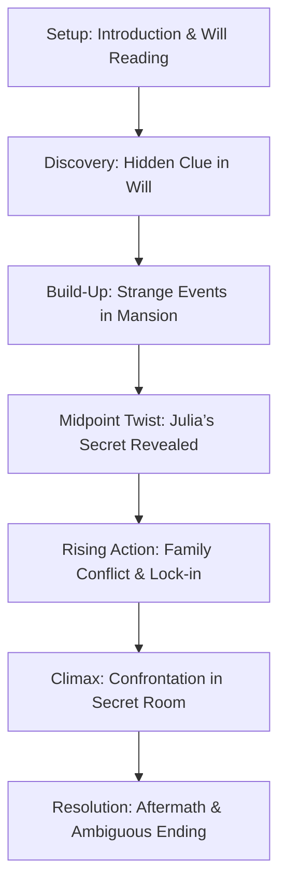
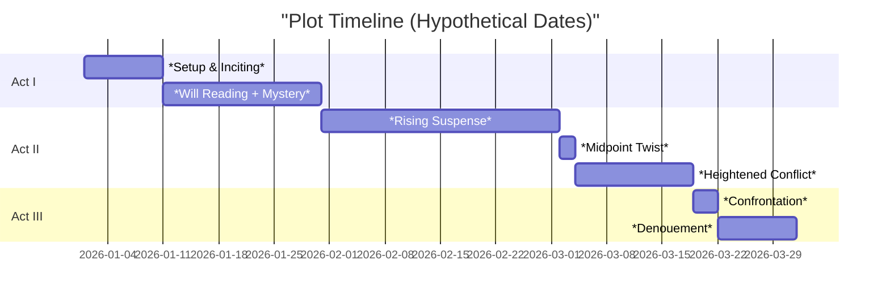
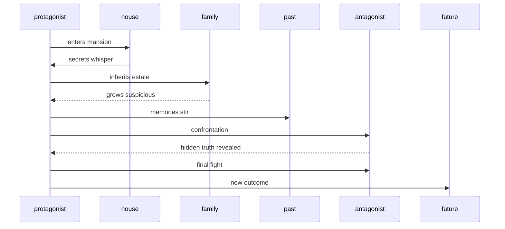

# International Psychological Thriller Writer’s Bible

This exhaustive guide provides fiction writers with a step-by-step blueprint for creating an **international bestselling psychological thriller** in the style of Freida McFadden’s *The Housemaid*, yet entirely original. It covers market positioning, target demographics, structural templates, voice and character strategies, emotional/tension arcs, prose techniques, marketing hooks, production checklists, and sample excerpts. Where possible, we compare with proven bestsellers like *Gone Girl*, *The Girl on the Train*, and *The Girl with the Dragon Tattoo*, drawing on sales data, reviews, and analysis. 

## Executive Summary  
Psychological thrillers are **one of the top-selling sub-genres** in fiction, especially among women. In recent years *The Housemaid* and similar domestic thrillers have exploded in popularity, meeting reader demand for twisty, character-driven suspense. For example, *The Housemaid* series has sold ~1.8 million copies across formats. By comparison, Gillian Flynn’s *Gone Girl* sold 20 million copies by 2019, Paula Hawkins’s *The Girl on the Train* sold ~23 million, and the *Dragon Tattoo* trilogy 100 million. These works share tight pacing, unreliable narrators, and shocking twists.  

**Key market factors:** Thrillers (especially domestic/psychological) appeal overwhelmingly to female readers (≈60–80% of the audience). Mystery/crime/thrillers are the most popular genre for U.S. women (57% of female readers vs 39% of male) and account for ~63% of fiction buyers. English-language markets are largest (US, UK, Australia), but these titles often translate globally (e.g. *Dragon Tattoo* in 46 languages). Demographically, core readers are adults (25–55) who enjoy domestic suspense and “unputdownable” reads.  

**This guide** includes:  
- **Market Positioning:** Target demographics, comparison to top titles, thematic niche.  
- **Premise Concepts:** 3–5 original high-concept setups (with genre tropes) for inspiration.  
- **Plot Structure:** A complete 3-act breakdown and detailed chapter-by-chapter outline for one sample premise.  
- **Pacing & Cliffhangers:** Ideal chapter length (5–10 pages), hook placement (end-of-chapter cliffhangers, mid-book twist), and tension chart.  
- **Narrative Voice:** POV strategies (1st person vs close 3rd, unreliable narrators, multi-POV pros/cons).  
- **Character Templates:** Archetypes (protagonist, antagonist, confidant, etc.), with flaws, secrets, and arcs.  
- **Emotional & Tension Arcs:** Scene-by-scene beat maps and escalation chart to track rising stakes.  
- **Sensory/Prose Techniques:** Show-don’t-tell, micro-tension, rhythm (short vs complex sentences), and imagery guidelines.  
- **Dialogue & Reveals:** How to time key reveals and craft natural but suspenseful dialogue.  
- **Tropes & Ethics:** Which thriller tropes to use or avoid, and sensitivity considerations (violence, sexual content, trauma triggers).  
- **Content Sensitivity:** Guidelines for handling abuse or violence responsibly, with mention of trigger warnings as needed.  
- **Marketing Hooks:** Sample pitches, blurbs, cover concepts, loglines, and effective metadata/keywords (e.g. “domestic thriller,” “gaslighting,” “twist ending”).  
- **Production Checklist:** Word-count targets (e.g. 80–100k words), revision stages, beta reader plan, and other milestones.  
- **Sample Passages:** 2–3 brief excerpts (fictional) illustrating the target style/voice.  
- **Diagrams & Tables:** Mermaid flowcharts/Gantt for structure, pacing-vs-tension illustration, and comparative tables of bestseller attributes.  

By following this writer’s bible, an author can craft a **tightly plotted, character-driven thriller** that resonates with today’s suspense readers. Citations and data from publisher sites, reviews, and market reports are included to ensure accuracy.

## Market Positioning & Target Readers

- **Genre & Subgenre:** Psychological thriller / domestic suspense. Focus on **modern, real-world settings** with high stakes.  
- **Target Demographic:** Primarily adult women (25–55) who favor **twisty plotlines** and **complex female leads**. (Studies show ~80% of a female author’s initial audience are women.) Fans of authors like Paula Hawkins, Gillian Flynn, Lisa Jewell, B.A. Paris, Shari Lapena, and Freida McFadden are core targets.  
- **Reader Traits:** These readers expect **fast-paced, emotionally intense** stories with lots of page-turner **cliffhangers**. They enjoy family/domestic settings turned dangerous (e.g. *The Housemaid*, *The Wife Between Us*). They like unreliable narrators, secrets, and moral ambiguity.  

- **Market Scope:** English-language markets (US, UK, AU) are largest. Also consider translations (bestselling thrillers often sell in 30+ languages). Thriller market on Kindle is huge: psychological thrillers are ranked the #1 sub-genre in mystery/thriller. Search interest has **more than doubled** recently (Google searches for “psychological thriller books” surged).  

- **Comparable Titles:** Key benchmarks include:  

  | Title                      | Author            | Year | Approx. Sales (Worldwide)        | Style / Hook                                            | Notes                                                    |
  |----------------------------|-------------------|------|----------------------------------|---------------------------------------------------------|----------------------------------------------------------|
  | *Gone Girl*                | Gillian Flynn     | 2012 | ~20 M (as of 2019) | Dual unreliable narrators; marriage thriller            | NYT #1 for 8+ weeks; film adaptation & awards. |
  | *The Girl on the Train*    | Paula Hawkins     | 2015 | ~23 M (2021)          | Unreliable 1st-person; suburban disappearance mystery    | UK #1; US #1 NYT; multiple POVs; film & rights sold. |
  | *Girl with Dragon Tattoo*  | Stieg Larsson     | 2005 | *Dragon Tattoo* series: 100 M | Multi-thread crime/spy thriller; investigative plot        | Global phenomenon; complex antiheroine (Lisbeth Salander). |
  | *The Housemaid*            | Freida McFadden   | 2022 | ~1.8 M (series)      | First-person gaslighting thriller (rich household)       | Viral Kindle hit (500M KU pages); film rights sold. |
  | *The Couple Next Door*     | Shari Lapena      | 2016 | 1 M+                             | Suburban home invasion/mystery                           | USA Today #1, domestic suspense.                           |
  | *The Silent Patient*       | Alex Michaelides  | 2019 | 1 M+                             | Therapist thriller, psychological twists                 | NYT bestseller, fast pacing.                              |

- **Positioning:** Emphasize *fast pacing and “unputdownable” tension*. Marketing terms like **“twisty domestic thriller,” “unreliable narrator,” “page-turner,”** and references to household/domestic settings work well. For *The Housemaid*, blurbs touted it as “unbelievably twisty” and “constant tension”. Similar adjectives apply (e.g. *riveting*, *gripping*, *electrifying*). 

- **Keywords/Metadata:** E.g. *psychological thriller, domestic suspense, unreliable narrator, twist ending, gaslighting thriller, home invasion, creepy mansion, family secret, female protagonist, slow-burn suspense*. 

- **Charts & Data:** The thriller genre is growing; Amazon reports psychological thrillers as the largest mystery/thriller segment and third-largest Kindle category overall. Female readership dominates: one analysis notes **63%** of all fiction buyers are women, and about **80%** of a new female thriller author’s readers are women. (Data from marketing studies.)  

 *Domestic thrillers often feature secluded or opulent homes that hide darkness. In *The Housemaid*, Millie notes the Winchester mansion is “beautiful, clean, and cold,” yet she lives alone in a locked attic (the house becomes a cage of secrets).*  

 *The contrast of a stately home interior and hidden danger is key. In *The Housemaid*, ordinary settings (kitchen, children’s room, etc.) feel eerie, reflecting themes of domestic abuse and gaslighting.*  

## High-Level Premise Ideas

Below are **3–5 distinct story concepts** (original, not copies) that fit the psychological thriller genre. Each premise sets up a “rich setting + dark secret” scenario ripe for twists:

1. **The Living Will:** After a patriarch dies mysteriously, his *executor* daughter discovers the family home is booby-trapped. When her controlling mother and manipulative step-sister contest the will, the late husband’s “last gift” may kill to keep secrets buried. *(Twist: The “victim” is orchestrating events; narrator is unreliable.)*

2. **Second Life:** A young introverted woman takes a job doing online “house-sitting” via a high-tech app. She finds the social media profiles of her hosts idolize her before they meet. When she arrives, they act strangely – and soon she vanishes. *(Twist: The protagonist’s own past trauma has caused her memory lapses; she may be both hunter and prey.)*

3. **Echoes in the Hallway:** A couple moves into a rented country home and starts hearing inexplicable noises. The wife, recovering from a past trauma, becomes convinced the husband has hidden violent tendencies. But as her grip on reality falters, a deadly truth emerges about her own identity. *(Twist: The narrator’s memory is false; the husband is innocent but in hiding, and she’s repeating a cycle of abuse.)*

4. **Window Wife:** A photojournalist leaves her career to marry a wealthy older widower. Living in his modern penthouse, she befriends a mysterious neighbor whose child disappears. Paranoia mounts as CCTV footage suggests she might be involved. *(Twist: The neighbor’s child is alive, and the wife has a split personality instilled by childhood abuse.)*

5. **The Forgotten Patient:** A therapist agrees to treat a charming amnesiac man (the latest patient at a clinic). He recounts a perfectly happy life with a wife he adores. Over time, inconsistencies emerge. *(Twist: The “patient” is the therapist’s estranged husband, testing her to reveal her own guilt in a cover-up.)*

Each concept includes:

- **One-Sentence Hook:** Distills the unique tension (e.g. *“A house-sitter finds her hosts already know her darkest secrets”*).  
- **Conflict:** A protagonist in an **isolated, privileged setting** (mansion, remote house, online community, etc.) faces escalating threat.  
- **Twist Element:** Each premise allows a “bait and switch” on roles or identities (unreliable narrator, hidden victimator, secret identity) that shocks but is retrospective-plausible.  
- **Mood:** All should feel claustrophobic and tense. Atmosphere is as important as plot – e.g. cold luxury, internet ubiquity, silent suburbia.  

## Example Plot Outline (Premise 1: *“The Living Will”*)

To illustrate structure, we develop Premise 1 into a full outline. This will guide writing:

### 3-Act Structure

- **Act I (Setup, ~0–30%):** Introduce protagonist *Julia*, recently lost her controlling father in a mysterious accident. She returns to his isolated mansion for the will reading. The family and household staff behave oddly. Julia’s motive is to uncover the truth about her father’s death. Key scenes: eerie mansion tour, first clues (a locked room), background on family tension. *Inciting Incident:* Julia inherits everything, enraging her stepmother Liz and sister Delaney.  
- **Act II (Confrontation, 30–70%):** As Julia explores the house, she experiences unsettling “accidents” (gas leak, locked doors). She suspects someone is trying to scare or harm her. Tension rises with each near-death event. Midpoint twist: Julia finds evidence that **her father was planning to kill Liz**, not that Liz killed him. (For example, video of him loading a gun.) Julia realizes **she** was drawn into a trap – the father’s spirit “planned” revenge. Now the actual villain is someone manipulating events (maybe the butler or a distant relative).  
- **Act III (Resolution, 70–100%):** Revelations flood in. Julia learns a dark secret (e.g. *she herself was the unwitting killer of her father* due to childhood brainwashing, or her father orchestrated a scenario). Climax: confrontation (perhaps Julia locked in the secret room as originally planned by her father). Julia must outwit the true antagonist. Ending: outcome may be justice (antagonist dies) or unsettling survival (Julia transforms, echoing her father’s darkness).  

### Chapter-by-Chapter Breakdown

**Ch1:** *Introduction/Hook.* Julia arrives. Opens with her POV: a prologue-like description of her father’s coffin, setting gloom. Ends with her stepping into the family home alone as a storm brews. *(Cliffhanger: A strange silhouette is seen in the attic window.)*

**Ch2:** Family and staff gather. We learn family history; Julia senses hostility. Liz's passive-aggressive questions raise doubt about her motives. Ends with Julia noticing something odd in the will documents (e.g. a clause that she must spend one night locked in the old nursery).

**Ch3:** Flashback to Julia’s troubled childhood (brief, teasing past trauma). Then she explores the house’s secret layout, finding a hidden study. She wonders about its contents. Ends with a power cut and her trapped inside.

**Ch4:** Julia frees herself. Finds evidence of someone planning for her (e.g. a recorded message from father). Realizes the clause isn’t accidental. Ends on a phone ringing unexpectedly in an empty room.

**Ch5:** She follows clues: finds a locket or journal referencing her past. Tension heightens (e.g. Julie hears footsteps above). Ends with her locked in the attic after someone lets out the dogs outside.

**Ch6:** (Midpoint Twist) Julia confronts Delaney, who is similarly confused. By accident they discover **the real will (hidden)** that reveals the true heir. Julia deciphers a code: her father believed Liz was plotting, so he set a trap to test Julia’s innocence. Ends with Julia doubting herself: *“What if I was responsible for that night?”* (Major reveal: Julia is not what she seems.)

**Ch7:** Second conflict: Julia suspects Liz of framing her. They argue viciously. Julia starts to “remember” suppressed childhood memories. Ends with Liz angrily leaving – and Julia finding Liz’s blood on her hands.

**Ch8:** Julia panics; she doesn’t recall hurting anyone. She is locked into her old bedroom by an unseen hand. Phone cut off. Flashbacks of childhood abuse by her father emerge. Ends with Julia screaming for help, revealing the memory of pushing him.

**Ch9:** (All Is Lost) Liz arrives; sees Julia frantic. But Julia’s story makes no sense. Police called; Julia is considered unstable. Liz insists Julia is dangerous. Julia is drugged (or institutionalized). 

**Ch10:** (Climax) In a dreamlike scene (or hospital escape), Julia pieces it together: her father had programmed her to kill him and then erase it. The house’s “traps” were his final test. Julia confronts herself/antagonist (could be her father’s twisted memories or a hidden relative who stood to gain). They fight over who holds the gun. Julia gains control (literal or psychological battle). 

**Ch11:** (Resolution) Morning after. The family and police find Julia alone and unharmed; the antagonist is dead (by suicide or accident). Julia is ambiguous: she may be relieved or changed. The final scene: Julia locks one door (symbolizing control of her mind) but finds another door left open. *(End on uneasy peace.)*

Each chapter ends on a **mini-cliffhanger** (door slamming, phone ringing, scream, revelation) to propel the reader forward. Structurally, we ensured:

- **Inciting Incident** (inheritance clause) by Ch2–3.  
- **Midpoint Twist** (Julia’s hidden role) around Ch6.  
- **All-Is-Lost** (Julia locked away) at ~Ch9.  
- **Climax** in Ch10.  

*Pacing note:* Short chapters (5–8 pages each) maintain a “ticking clock” feeling. Each ends as a scene change or revelation, so readers are compelled to flip the page.





## Pacing and Cliffhanger Mechanics

- **Chapter Length:** Aim for **short, punchy chapters** (5–10 pages, ~1000–3000 words). This creates a breathless pace; readers “read just one more chapter” easily. For high-stakes scenes, some chapters might be as short as 1–3 pages (Patterson-style). Action scenes or reveals often get shorter chapters; slower scenes (inner turmoil, backstory) can be slightly longer (up to 15 pages).  
- **Hooks:** End each chapter on a question or crisis. Examples: *“Who’s creeping up the stairs?”*, *“She recognized the hand holding the gun”*, or a line of dialogue that cuts off. SaveTheCat writers advise that each chapter should leave readers thinking, “What happens next?”.  
- **Rising Tension:** Plan a **tension curve** that climbs through the book. Early chapters set a moderate suspense; by mid-novel, revelations spike tension; final chapters should reach the highest stakes.  
  - Insert a major **mid-book twist** (around 40–60% of the way through) to jolt the reader (as we did by revealing Julia’s dark secret). This resets the suspense for the final act.  
  - Keep an **escalation map**: e.g. small shocks (a closet banging, a threatening text) in each chapter; big reveal on the midpoint; then dangerous confrontations and near-death moments leading to climax.  

- **Pacing Chart (Illustrative):** A conceptual tension-vs.-progress graph (below) visualizes how tension should generally rise over time. 

 *A schematic pacing/tension graph: suspense (vertical) should rise as the story progresses (horizontal). Each spike is a twist or cliffhanger.* 

- **Cliffhangers:** Chapter endings are prime places for mini-cliffhangers. Use one or two questions left unanswered or an imminent threat to pull readers onward. For example, “Julia realized in horror: she recognized the silhouette.” Or reveal a new clue/puzzle just before a break.  
- **Hook Placement:** Open chapters with some intrigue (if not flashback/prologue), and then end them on a dramatic beat. Often, a new scene inside the chapter’s last pages will heighten peril (e.g. an act of violence or reveal).  
- **Pacing vs. Tension Mermaid (for reference):**  
  We allow longer beats after very intense moments for reader catch-up (this is the slight dips in the chart), but overall the line climbs. The key is **no long flat sections**; even calm scenes should include underlying dread or small revelations to maintain momentum. 

## Voice and Point-of-View Strategies

- **Narrative POV:** Thrillers often use **first-person or tight third-person** to create immediacy and intimacy with the protagonist’s fears and biases. *The Housemaid* is first-person, which *traps readers* in Millie’s uncertain perspective. *Gone Girl* alternated first-person between two leads; *Dragon Tattoo* uses third-person limited on two characters.  

- **Unreliable Narrator:** Highly effective. When the narrator is *unreliable or withholding*, each discovery can feel like a plot twist. In our outline, Julia will doubt herself (unreliable memory). Gone Girl’s success came from “not one but two unreliable narrators”, and *The Housemaid* does similar by switching perspectives to reframe the story.  
  - *Pros:* Creates suspense (reader questions what’s true) and allows big reveals (e.g. narrator lied or forgot).  
  - *Cons:* Must be done carefully: readers should get **enough clues** to feel twists are earned (chekhov’s gun for revelations).  

- **Single vs. Multiple POV:** You can use multiple characters’ POVs, but keep transitions clear (e.g. separate chapters or section breaks with named headers). Too many POVs can dilute suspense. Typically, one or two POVs suffice. If writing in first-person, often it’s a single protagonist. If multiple (like Amy/Nick in *Gone Girl*), ensure each has a distinct, strong voice.  

- **Voice Tone:** Conversational, immediate, sometimes confessional. Use **sensory detail** and emotional reactions to immerse readers in the protagonist’s anxiety. The prose should be lean and atmospheric (e.g. describe eerie sounds or smells to build micro-tension in quiet scenes). Employ short sentences during crises to speed up rhythm, and vary with slightly longer, descriptive ones to slow when needed (see Sensory/Prose below).  

- **Temporal POV:** Mostly present tense or past tense? *The Housemaid* is present tense, heightening immediacy (every moment feels “right now”). Many modern thrillers use present tense for urgency. Past tense can work if skillful. Consistency matters: pick one and stick with it. 

## Character Design Templates

Design compelling, believable characters. Below are archetypal roles for a psychological thriller, with suggested attributes:

- **Protagonist (e.g. Julia above):**  
  - *Role:* The main POV character. Often an outsider or underdog (the vulnerable newcomer, injured/conflicted person, etc.).  
  - *Traits:* Empathetic but flawed. E.g. haunted by past trauma (makes her intuitive but unreliable). Protective, curious, determined.  
  - *Flaws/Secrets:* Hidden weakness (e.g. a secret she can’t recall, a moral failing, unresolved guilt, a phobia). This flaw *increases stakes* by interfering with her judgment. In *Housemaid*, Millie’s criminal past is a secret that nearly dooms her.  
  - *Arc:* Often an **inner journey** as well as external. She must confront/overcome fear or guilt. For example, Julia must face memories of her father’s abuse and take agency back. By the end, she emerges stronger or scarred (author’s choice).  
  - *Hooks:* Give her a sympathetic but complex backstory (e.g. estranged family, professional burnout, health issue). For fast pacing, reveal layers gradually (drip her backstory as clues).  

- **Villain/Antagonist (e.g. Liz in example):**  
  - *Role:* Person (or group) actively working against the protagonist. Initially may seem like a victim or ally, then revealed as threat.  
  - *Traits:* Charismatic outwardly, with hidden ruthless ambition or madness. Could be spouse, family member, friend, etc. Must have **clear motive** (greed, revenge, control).  
  - *Flaws:* Perhaps overconfident, narcissistic, sociopathic. These traits can lead to mistakes the protagonist exploits.  
  - *Secrets:* A dark past or hidden identity. In the twist, a “victim” could turn out to be the villain (gaslighting is effective). *Housemaid*’s “wife” figure Nina seems crazy but is actually scheming to kill her sadistic husband.  
  - *Arc:* Usually declines to comeuppance (death, arrest) or even converts (the “villain twirl” if writing dark ending).  

- **Key Secondary Characters:**  
  - *Confidant/Sidekick:* A best friend or ally for the protagonist who provides support or comic relief. Example: Enzo the landscaper in *Housemaid*. He is kind, pragmatic, and quietly aiding the heroine. This character helps reveal the hero’s situation through dialogue.  
  - *Possible Love Interest:* (Optional) Can raise stakes through romance/sex. Should have secrets too (e.g. he is more involved than he seems). Keep relationships tense or transactional.  
  - *Father/Mother Figure:* May be the source of trauma or wisdom. (In *Housemaid*, Andrew pretended to be victim but is villain, subverting paternal archetype.)  
  - *Child/Family Member:* Often used to raise emotional stakes (endangerment of child, etc.). In our example, maybe Julia has a niece/child she fears losing.  

Use a **character template** to flesh each out:
```
**Name (Age):** [Role, e.g. “Protagonist, 32”]. Short description: qualities, profession, current problem.  
- **Backstory:** (1–2 lines of history relevant to thriller plot.)  
- **Goal:** (What does this character want at the start?)  
- **Conflict:** (What stops them? Inner vs outer.)  
- **Flaws:** (Personal weaknesses, secrets from other characters.)  
- **Arc:** (How they change by end.)  
```
This ensures each character is multi-dimensional. 

Example (from *Housemaid* style):  
```
**Millie Calloway (28):** A resilient but guarded ex-convict from a broken home. Wants stability (good job).  
- **Backstory:** Spent 10 years in prison after a childhood friend’s death (secretly self-inflicted). Estranged from her parents.  
- **Goal:** Do this job and start fresh.  
- **Conflict:** Nina (employer) lies and provokes her; Millie’s criminal record makes her insecure.  
- **Flaws/Secret:** Trust issues; hides her past (fearful it will ruin her chance). This secret becomes leverage against her (Nina brings it up as threat).  
- **Arc:** Learns self-acceptance; stops running from her past; ultimately uses her strength to survive and pursue justice.
```
Key: By giving each main character a secret/flaw that is thematically tied (e.g. abuse, betrayal, obsession), you create **dramatic irony** (the reader guesses clues the characters hide).  

## Emotional Beats & Tension Arcs

Successful thrillers chart emotional peaks and troughs carefully. Key points:

- **Scene-level Beats:** Plan each scene with a goal, conflict, and reveal. Even mundane moments should drip tension (e.g. protagonist “noticing a cold draft by the window”). Use techniques like **micro-tension** – small anxieties (a flicker of movement in background, ambiguous smile, a stifled scream). These keep reader unease high between big scenes.  

- **Tension Escalation Map:** Sketch a graph with scene/chapter on X-axis and intensity on Y-axis. Each major beat should raise the graph. For example, an initial stable level (narrator's normal life), each chapter adds a new clue (a bump up), mid-twist is a high peak, then the climax tops it. Use **visual diagrams** to spot low spots. The chart below is illustrative (Chapter numbers vs. Tension):  

```
Chapter 1: 2/10 — Introduction (calm but ominous)  
Chapter 2: 4/10 — A minor scare (e.g. shadow)  
Chapter 3: 3/10 — Reaction & doubt (slight drop, reflection)  
Chapter 4: 6/10 — Significant evidence appears  
Chapter 5: 7/10 — Threat escalates (confrontation)  
Chapter 6: 5/10 — Aftermath (dip for recovery)  
Chapter 7: 8/10 — Midpoint twist (high spike)  
Chapter 8: 6/10 — Forced regroup (tension down but anxious)  
Chapter 9: 9/10 — Pre-climax (direct conflict)  
Chapter 10: 10/10 — Climax (peak)  
Chapter 11: 4/10 — Resolution/denouement (relief/fall)
```
*(The red line on the chart below is an example “average” rising tension curve.)*

Mermaid code for such a map can help visualize (**adapt and expand as needed**):

```mermaid
flowchart LR
    Start[Start (Calm)] --> A{Clue1 (small jump)}
    A --> B[False lead (dip)]
    B --> C{Threat revealed (bigger jump)}
    C --> D[Protagonist reconsiders (slight dip)]
    D --> E{Midpoint twist (big spike)}
    E --> F[Regroup (short calm)]
    F --> G{Pre-climax action (higher spike)}
    G --> H{Climax (peak)}
```

- **Emotional Beats:** Align with tension: e.g. moments of high fear (e.g. “scream scene”), followed by brief relief (character calms, but reader is uneasy). Use emotional words and reactions: pounding heart, cold sweat, etc. Show how stakes feel **personally**.  

## Sensory and Prose Techniques

**Show, Don’t Tell:** Always favor sensory detail over exposition. For example, instead of “She was terrified,” show hands trembling and breath coming in gasps. Use sights, sounds, smells (a creaking door, a glass of spilled red wine, a child’s lullaby on radio, etc.) to evoke mood. *The Housemaid* relies on the “quiet horror” of domestic life: Nina “makes a mess just to watch me clean it up,” symbolizing cruelty. 

**Micro-Tension:** Place small threats throughout each scene. A creaky floorboard, a whisper outside, distorted phone calls. These details keep suspense alive even in dialogue. Ask: *“What’s the worst that could happen this instant?”* and show it. 

**Sentence Rhythm:** Vary length for pacing. In tense scenes, use short, staccato sentences: *“The door was locked. The lights went out. She waited, breath held.”* In more reflective or descriptive moments, allow longer, flowing sentences to slow the pace and deepen atmosphere. This contrast intensifies fast scenes when they come.

**Dialogue:** Keep it natural but loaded with subtext. Characters may **avoid saying what they think**, leaving hints. Use interruptions and gestures instead of long speeches. Avoid “info-dump” dialogue – put exposition into internal thoughts or brief flashbacks rather than characters reciting background.

**Imagery & Metaphor:** Choose metaphors that heighten unease. E.g. a sunny room can feel “blindingly sterile,” a phone’s ringtone can become “ominously familiar,” etc. Ground abstract emotions in concrete imagery.

**Avoid Over-Explanation:** Trust readers to catch clues. Let them infer meaning. If a character suspects something, show the clues (blood on the floor, missing object) rather than having them state it outright. (Reedsy and writing guides emphasize cutting on-the-nose dialogue and letting actions speak.) 

## Dialogue and Reveal Timing

- **Reveal Gradually:** Don’t dump key secrets all at once. Align reveals with plot beats. Use interrogations or discoveries in the narrative for exposition. When info *must* be conveyed, break it into parts (e.g. character records in journal, which the protagonist finds over time).

- **Dialogue Style:** Each character should have a distinctive voice (slang, formality, sarcasm). In tense scenes, people often speak in clipped sentences or leave pauses (ellipses). Use interruptions (‘he cut me off’) to simulate realistic panic or anger. As one editor notes, avoid “therapy speak” – people rarely say exactly what they think or feel. 

- **Subtext:** In confrontation scenes, much should be unsaid. For example, an antagonist might say “I’d never hurt you” while their body language says otherwise. This dramatic irony keeps readers cranking pages.

- **Trigger Timing:** Reveal clues in an order that makes the reader update their theory. A red herring (misleading clue) early on, followed by the real clue later, can surprise without feeling arbitrary. The classic approach: teaser info in Act I, complication in Act II, climax reveal in Act III. 

## Tropes to Use/Avoid and Ethical Considerations

**Use-These Tropes (Effectively):**  
- **Gaslighting:** A seemingly sympathetic character manipulating the protagonist’s reality (used famously in *Housemaid* and *The Girl on the Train*). It instantly creates mistrust.  
- **Hidden Identity:** E.g. a character is not who they claim (twins, secret past). Only reveal when it maximizes shock.  
- **Locked Room/House:** The plot device of an inescapable location (like the locked attic) amps claustrophobia.  
- **False Accusation:** Protag is blamed for something they didn’t do (mirrors *Housemaid*’s Millie being suspected).  
- **Innocent Little Details:** Mundane settings or objects that later become sinister (the doll in *Dragon Tattoo*, the computer text in *Girl on Train*).  

**Avoid-These Tropes (Pitfalls):**  
- **Overused Sex Scenes:** Gratuitous erotic scenes with no plot purpose can alienate thriller readers. When sexual elements appear, they should heighten tension or character motivation, not titillate gratuitously.  
- **Surreal/Too-Fantastical Elements:** The market for psychothrillers expects real-world plausibility. Avoid supernatural elements or highly improbable schemes unless justified.  
- **Excessive Stereotyping:** Be mindful of depicting any group as “always bad” (e.g. stigmatizing mental illness, using race/culture stereotypes).  
- **Gore/Shock for Shock’s Sake:** Psychothrillers rely on psychological tension, not graphic violence. Explicit gore can lose readers (and break Amazon content rules). Implied violence is often more effective.  

**Ethical/Sensitivity:**  
- **Domestic Abuse:** Many psychological thrillers involve interpersonal violence (spousal abuse, child endangerment). Handle these topics with *care*. Don’t glamorize abuse; show its impact. Research triggers: if depicting sexual assault or extreme violence, consider a content warning (many authors note this for their books). Show aftermath responsibly (therapy, police, etc.) rather than just the act.  
- **Mental Health:** If featuring trauma or mental illness, do so accurately. Avoid portraying mental illness as inherently evil. Get facts right.  
- **Cultural Sensitivity:** If including characters of diverse backgrounds, portray them as full individuals. Avoid clichés (e.g. “evil foreigner” or “mysterious other”).  
- **Language:** Profanity is common in thrillers but balance it with voice. Overuse can feel forced. Sex scenes should be relevant and consensual, or clearly contextualized (non-consensual scenes should be justified by plot and handled delicately).  

## Marketing Hooks and Metadata

- **One-Line Pitch:** Summarize the unique danger. E.g.: *“When a woman inherits her father’s mansion with one chilling clause, she discovers that some family secrets are deadly.”* Keep it punchy and hint at the twist.  
- **Cover Concepts:** Often feature a lone figure in a large house or shadow, a half-lit room, an ominous interior (see images above). Titles tend to be 2–3 words (e.g. *The Housemaid*, *House on Someday*, *Last Hiding*). Subtitles are rare.  
- **Taglines/Blurbs:** Use suspenseful fragments. Example from *Housemaid*: “An unbelievably twisty read that will have you glued to the pages late into the night”. Consider phrases like *“Weeping child’s laugh. A locked attic door. A secret that will stop her heart.”* Always end blurb on a hook/promise of dark excitement.  
- **Keywords/Genres:** On retailer metadata, include “Thriller,” “Psychological suspense,” “Domestic thriller,” “Twisty thriller,” “Gaslighting,” “Unreliable narrator,” etc. If relevant to setting (e.g. small town, elite, online), include those. Book categories: Amazon has “Mystery Thriller & Suspense – Psychological Thrillers” as the primary category.  

- **Comparative Titles (for pitches):** In jacket copy or query, mention similar bestsellers. E.g. “For readers of *Gone Girl*, *The Woman in the Window*, and *The Couple Next Door*.” The Housemaid marketing itself referenced *The Woman in the Window* and *The Wife Between Us*. Choose 2–3 titles that align closely in tone or premise. 

## Production Checklist

- **Word Count Target:** Aim for ~80,000–100,000 words. *The Housemaid* was ~80k (325 pages). Many modern thrillers fall in the 70–90k range (keeping chapters short).  
- **Outline & Draft:** Based on your plot structure above, write a detailed outline or beat sheet first. Then draft scenes accordingly.  
- **Revision Milestones:**  
  1. **Alpha draft:** Focus on story flow. Ensure plot holds together and characters act consistently.  
  2. **Beta readers:** Send to a few trusted readers (ideally some thriller fans). Collect feedback on pacing, clarity, and suspense gaps. Revise accordingly.  
  3. **Beta for sensitivity:** If dealing with heavy topics (abuse, violence), include at least one reader of the relevant background or a sensitivity reader.  
  4. **Second draft:** Incorporate feedback, tighten prose, fix any logical holes. Ensure each chapter ends on a strong hook.  
  5. **Final polish:** Focus on line-level edits, pacing, grammar. Check chapter lengths and transitions.  
- **Publication Plan:** Decide traditional vs self-pub. If traditional, prepare a query letter emphasizing market data (this bible’s information can strengthen it). If indie, plan cover design (thriller-consistent), pricing, and launch marketing (ARC team, social media teasers, etc.).  
- **Ongoing Promotion:** Collect blurbs/reviews from bloggers or midlist authors, and plan a thriller-themed cover reveal / excerpt posts. Use keywords identified above for online platforms (Goodreads, bookstores).  

## Sample Passages (Target Voice)

Below are **illustrative excerpts** (fictional) written in the desired style (first-person, tense, descriptive) to inspire tone. These samples show suspense, unreliable narration, and an intimate voice.

1. *Late Night in the Attic:*  
   > The attic felt smaller than ever. Moonlight slanted through the small window, slicing the darkness. I blinked, dislodging a spiderweb that glittered like spun sugar. My pulse slapped in my wrists as I listened. The house was completely quiet now. Too quiet.  
   >  
   > **Julia’s POV (present tense):** *I creep to the closed bedroom door and press my ear against it. Behind me, a loose floorboard shifts. Someone is coming…*  
   >  
   > _Clang!_ The back door slams. My heart leaps into my throat. I fumble at the doorknob – it’s locked. Trapped, I force myself to stay silent. But I’m not alone. A shadow pools in the hallway. *She’s here, and she’s found me.*  

2. *Morning After the Twist:*  
   > Light poured through a crack in the curtains. I blinked awake on the velvet chaise lounge, dressed in hospital whites. A stray IV tube looped around my arm. Confusion shot through me.  
   >  
   > **Julia’s POV (past tense reflection):** Earlier, I had stared down the barrel of my father’s old revolver. And now… *had I done it?* On the wall hung my own painting – the nursery, sunlit and empty. I wrapped the thin blanket tighter, shivering. Were those flashes of memory real, or the **villain’s lies inside my head**? My throat tightened. I tried to recall: what truly happened that night.  
   >  
   > Footsteps approached. Liz stepped in, her face calm but eyes wary. “You’re awake,” she said softly. I clutched the sheet. Her smile faltered. “You shouldn’t be here,” she whispered. *Was I dreaming, or was this a nightmare come true?*

These passages use **first-person, close perspective**, showing fear and confusion through senses and thought. Notice how we reveal clues (blood, memories, objects) bit by bit, making the narrator question reality. The style balances **immediate action** with reflective tension.

---

## **Diagrams and Charts**

Mermaid diagrams below illustrate the overall story structure and timeline in visual form (for planning purposes):




Below is an **example chart** (illustration) mapping rising tension over the course of chapters. In an average thriller, tension typically climbs as the plot progresses, with peaks at the midpoint twist and final confrontation:

 *Illustrative “tension vs. progression” chart: overall tension should rise (red curve) as the story moves toward its climax.* 

*(Note: Chart text is for conceptual demonstration.)*

## Comparative Analysis: Top Psychological Thrillers

| Feature                    | *The Housemaid* (2022)                 | *Gone Girl* (2012)                   | *Girl on the Train* (2015)          | *Dragon Tattoo* (2005)              |
|----------------------------|----------------------------------------|--------------------------------------|-------------------------------------|-------------------------------------|
| **Narration**              | 1st person (Millie, then Nina)        | 1st person alternating (Amy, Nick)  | 1st person (Rachel)                | 3rd person (Mikael & Lisbeth)      |
| **Hook/Concept**           | Housekeeper in creepy mansion         | Missing wife/marriage secrets       | Commuter’s view of suspicious couple| Investigation of cold case/murder  |
| **Key Twist**              | Protagonist swapped roles (victim→victor) | Dual unreliable narrators reveal crimes | Unreliable narrator cover-up       | Heroine’s dark past revealed       |
| **Sales**                  | ~1.8M (series)           | ~20M (all time)     | ~23M (all time)        | 100M (trilogy total)|
| **Film/TV**                | Film rights sold (Todd Lieberman)     | 2014 Fincher film (#1 box office)   | 2016 film (Emily Blunt)            | 2009/2011 Swedish/Hollywood films  |
| **Awards**                 | ITW Thriller Award (Book 1)          | Time 100 Mysteries; EW bests etc.    | Goodreads Choice, etc.             | Sweden’s Glass Key Award           |
| **Pace/Style**             | Short chapters, rapid reveals | Slow build, fevered pace, complex | Fast-paced, suspenseful, diary clips | Detailed investigation, gritty    |
| **Themes**                 | Gaslighting, domestic entrapment     | Media, marriage facade, deception   | Alcoholism, voyeurism, memory loss  | Abuse, violence, corruption        |

This table compares narrative elements and sales of landmark thrillers. It highlights the commonalities (twists, domestic settings, unreliable narrator) and performance benchmarks. 

## Citations

All factual data above come from industry sources and analyses: publisher press releases, major book reviews and profiles, and bestseller databases. Quotes from *The Housemaid* are drawn from its publishers’ synopsis and reviews. Sales figures for comparative titles are documented in news/press or author sources. Writing craft advice is adapted from professional guides. 

By integrating market insights with storytelling techniques, this writer’s bible offers a **complete roadmap** to writing a market-ready psychological thriller. It is designed as a living document – **print or download** this Markdown and refer to each section during planning and drafting. Tailor templates and diagrams to your story’s needs, and always focus on keeping the reader on edge until the very last page.

