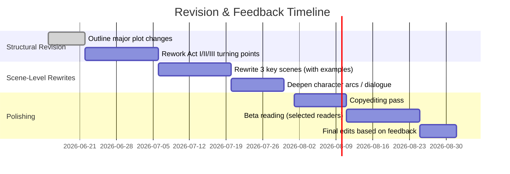

# Executive Summary  
**Strengths:** The manuscript has a compelling core mystery and a high-stakes psychological twist, with a modern, feminist-tinged voice. Its multi-character perspective and domestic setting recall hits like *Gone Girl* and *The Girl on the Train*, and it explores memory, trauma, and secrets in a way that naturally grips readers. The author’s background in psychology (e.g. the protagonist is a therapist) provides authentic insight; indeed, authors like MM Desch advise using real clinical experience to ground character motivation. The writing shows promise in vivid scene descriptions (e.g. sensory details like “salt air and moonlight”) and a taut present-tense style that heightens immediacy. Key scenes (the prologue’s childhood tension, the climactic revelations) can deliver strong emotional payoff when fully realized.  

**Weaknesses:** Pacing is uneven: some scenes over-explain or stall (e.g. repeated measurements of the hallway length and “The house is just a house…” comments), which diffuses tension. The early chapters (especially the arrival and set-up) contain expositional telling (“five meters long – I know the layout by heart”) that can be trimmed or dramatized (see *Scene Rewrite Examples* below). Character voices risk blending together; stronger distinct diction or deeper inner conflict is needed. Several plot points (the identity of the culprit, motives of certain characters) need clearer foreshadowing or misdirection to make the later twist feel earned rather than abrupt. Technical details should support suspense, not distract (e.g. avoid unnecessary details like specific ruler lengths). Some dialogue and narrative passages currently “tell” emotions rather than show them; practice in “show, don’t tell” (as MM Desch advocates) will make emotional beats more powerful. Copyediting is needed to fix minor repetition, tighten syntax, and ensure consistency of point-of-view (POV) and tense. In summary, the concept and voice are strong, but revisions should focus on tightening structure, sharpening suspense, and deepening psychological realism. 

# Chapter-by-Chapter Critique Template  
*(Design this checklist for use with **any** draft.)* For each chapter or scene, evaluate:  

- **Opening Hook & Inciting Event:** Does the chapter start with a grabbing image or conflict? What new information or tension is introduced?  
- **Purpose of Scene:** What does this scene accomplish (plot advancement, character insight, theme)? If it accomplishes neither, it may be cut or combined.  
- **Character Objectives & Conflicts:** For each POV character present, what are they trying to achieve here? Are their goals clear? Is there an obstacle or conflict? Scenes with low conflict should be heightened or trimmed.  
- **Psychological Realism:** Does the character’s behavior and inner monologue feel true to their profile? Check consistency in how trauma, memory loss, or manipulative tactics (gaslighting, addiction) are portrayed. Refer to expert guidelines (e.g. portray progression of psychosis or PTSD triggers rather than mere labels).  
- **Narrative Voice & Unreliability:** If using a first-person or limited POV, note whether the voice remains consistent. Are we getting the truth, or do clues suggest the narrator is withholding? Good unreliable narration should feel natural and not betray by **excessive** hints.  
- **Stakes and Tension:** Does the scene raise questions or stakes? It should escalate tension toward chapter end (a question or mini-cliffhanger). Each chapter should accomplish at least two story “beats” (move plot, deepen character, plant a clue, etc.). If a scene lags, consider cutting or adding urgency (a sudden event, a revelation, etc.).  
- **Setting and Atmosphere:** Is the scene’s location clearly drawn? Check for opportunities to use setting (weather, time, place) to mirror mood or theme. Avoid unnecessary expository details (e.g. arcane measurements of hallway length) – instead, show mood (“the hallway stretched far into darkness”) for atmosphere.  
- **Foreshadowing & Clues:** Note if clues or red herrings are placed strategically. A well-timed midpoint twist must be set up naturally (Save-the-Cat advises the Midpoint *changes everything*). Ensure no crucial evidence is missing or feels “handed” to the reader.  
- **Voice and Prose:** Check for voice consistency (especially with multiple narrators). Mark clichés or telling phrases (“house is just a house,” “I know the way without GPS”) and rewrite them vividly. Look for overused words or adverbs (“really,” “very,” “suddenly”) and replace with specific sensory details.  
- **Pacing:** Is the scene too slow or rushed? (“Write quick things slowly, slow things quickly”). Check paragraph and sentence length variety. Use the WD pacing trick: each scene should accomplish something; if not, break it up.  
- **Dialogue Quality:** Are voices distinct? Is small talk minimized? Dialogue should reveal character or move plot. Add subtext: what characters *aren’t saying* can build suspense.  
- **Emotional Arc:** How does the protagonist change through the scene? Even if no plot event occurs, an internal change or realization should happen. Note if emotional beats feel flat or if reactions seem off.  
- **Chapter Ending:** Ensure each chapter ends with a “hook” — a line or situation that makes the reader want more (a reveal, a question, a cliffhanger).  

Use this template as you go from chapter to chapter, annotating the manuscript for the above points. In your notes, highlight both successes (“strong hook,” “intriguing clue”) and problems (“info-dump,” “weak transition,” “mixed metaphors”).  

# Prioritized Revision Roadmap  

1. **Strengthen the Opening (Prologue & Chapter 1):** Make the emotional hook immediate. For example, clarify the protagonist’s core fear or memory on page one, rather than delaying it. Trim unnecessary exposition (e.g. details about landlord email or travel time can be condensed).  Consider adding an inciting crisis (even a brief threatening phone call or flashback) to set the alarm bells from the first line.  

2. **Consolidate Redundant Explanations:** Remove repetitive phrases like “The hallway is five meters long” or “The house is just a house” (seen in Chapters 2–4). Replace them with evocative descriptions or emotional reactions. *Before/After Example #1:* A passage that literally measures the hallway (“I measured it with a steel ruler” – mundane telling) can be rewritten to reflect mood (“The hallway stretched into gloom… bones of childhood memories creaked underfoot” – vivid showing).  

3. **Sharpen Character Voices & Arcs:** Give each POV character a distinct voice and clear motives. For instance, ensure Neve’s internal tone (an anxious therapist recalling trauma) differs from Saskia’s (maybe more pragmatic or controlling). Make sure Aisling/Cate’s revealed secret is seeded subtly (a look she gives, a slip of detail) to justify the mid-story twist. Strengthen the protagonist’s arc: e.g. Neve’s journey might move from shock/doubt to confident reclaiming of truth; highlight those shifts in key scenes.  

4. **Enhance Tension in Transitional Scenes:** Some scenes (dinner, road trips) may slow the pace. Inject conflict or suspense: perhaps hint at unseen eavesdroppers, or use phone calls/texts that escalate. When friends reunite, play up the uneasy familiarity and secrets between them. Ensure “Bad Guys Close In” beats intensify after midpoint. For example, if a scene currently has the group chatting calmly, break it with an accusation or an ominous distraction (e.g. a phone text about a memory to imply someone is leaking secrets).  

5. **Foreshadow the Climax:** Introduce logical clues earlier so the final reveal isn’t out of left field. If Elaine (the mother figure) is the culprit, sprinkle subtle hints of her anxiety or contradiction in the prologue and early chapters (e.g. her tearful phone call in Chapter 9 could earlier be a subconscious echo). As Carter Wilson advises, the unreliable narrator should be believable and “convinced they are telling the truth”. Make sure any inconsistencies (e.g. Neve’s memory vs Elaine’s story) are planted.  

6. **Rewrite Key Passages for Impact:** Identify weak spots (see examples below) and rewrite them. Focus on strong imagery, active verbs, and character perspective. For prose that feels “telling,” recast it as action or sensory experience. For instance, replace any flat sentence (“I sit in the driver’s seat and breathe the way I teach my clients to”) with a more immersive moment of Neve trying to calm herself.  

7. **Pacing & Structural Beats:** Check that each act’s beats align with best practices: introduce major conflict (Act I), deliver a *Midpoint Twist* that changes goals, then build to an *All-Is-Lost* moment (Act II), and climax (Act III). If pacing drags, tighten scenes or move exposition into dialogue or internal thought. Consider whether adding or cutting subplots would improve momentum. Use the “page/pad metronome” trick: after every 5–10 pages, revisit to ensure each chunk advances the plot or deepens conflict.  

8. **Market-Style Polishing:** Read the novel aloud and tighten similes/metaphors to avoid clichés. Ensure taglines in marketing materials echo thriller conventions: for example, PRH’s *The Sanatorium* sells itself as “spine-tingling, atmospheric…twists you’ll never see coming”. Adopt a similar tone in the blurb and query.  

9. **Copyediting and Consistency Pass:** Finally, correct grammar (e.g. punctuation around em-dashes), check for typos (e.g. “the porch is wi[ndow]”), and ensure tense/POV consistency. Standardize timeline details (if the reunion is a specific weekend, keep all dates clear).  

10. **Beta & Expert Feedback:** Once revisions are done, seek targeted beta readers (see below) and consider professional editing for polish. Their fresh eyes will catch any lingering plot holes or readability snags.  

**Scene Rewrite Examples (Before → After):**  
- **Scene (Hallway Telling):** *Before:* “The door opens into a hallway. The hallway is five meters long. I measured it… with a quarter-inch steel ruler.” *(Telling, static)*.  
  *After:* *“The front door swings open onto a narrow hallway. The oak floorboards, familiar yet oddly distant under my feet, stretch toward a distant glow. In the dim light, every scuff and nail-head on the walls seems etched with secrets I can almost recall. The only noise is my breath — slow, steady — as I take a silent step inside.”* *(Shows mood and memory rather than dry measurement.)*  

- **Scene (Self-Calming):** *Before:* “I sit in the driver’s seat and I breathe the way I teach my clients to. The house is just a house. It’s been renovated. Someone has lived here for years. It’s just walls and a roof and windows and a floor.” *(Over-explained attempt at calm.)*  
  *After:* *“Heart pounding, I close my eyes in the parked car and inhale deep, clinical breaths. In… out… as I always taught others to do. The safe rationalization rings hollow. This *was* just a house once, I repeat, though the fresh paint and new carpet feel plastered over something far older. My hands tremble on the steering wheel — a reminder that a house, no matter how ordinary, can hold extraordinary fear.”* *(Shows emotion and doubt rather than blunt statement.)*  

- **Scene (Intermediate Suspense):** *Before:* [A quiet dinner conversation that lulls the reader.]  
  *After:* *Interject a ticking tension: glasses tinkling as Saskia’s knee bounces nervously, Imogen’s gaze flitting to a locked closet, a sudden news report murmuring from a forgotten radio, or an old photograph (with Elaine) sliding off the wall unbidden.*  
  *(No citation; use creative scene-building to maintain suspense at all times.)*  

# Psychological Research & Consultants  
To ensure accuracy and depth, consult psychological literature and experts on the relevant issues:

- **Academic & Nonfiction Sources:**  Trauma and memory are central themes. Key resources include Bessel van der Kolk’s *The Body Keeps the Score* (trauma’s physiological effects) and Judith Herman’s *Trauma and Recovery* (long-term impact of childhood trauma). For mental illness portrayal, use the DSM-5 criteria and summary references (e.g. National Alliance on Mental Illness overviews). Carter Wilson (thriller author) emphasizes that an unreliable narrator should be “a fully formed individual who is convinced they are doing the right thing, despite all evidence to the contrary” – this aligns with realistic, non-‘coy’ portrayal of self-deception.  

- **Professional Consultants:** If a character is a therapist or police officer, consult a practicing psychologist/psychiatrist or detective to verify procedure. For example, *psychiatrist-turned-author* M.M. Desch used her experience to craft authentic scenes (e.g. showing the progression of psychosis rather than labeling it). Consider hiring a clinical psychologist (perhaps a PhD or practicing therapist open to consultations) to review key scenes of trauma or therapy. Reedsy and critique forums suggest “consult people who have worked in a profession featured in your book… or a sensitivity reader” for accuracy.  

- **Specific Topics:** If the plot involves a memory disorder or gaslighting, consult neuroscience or clinical neuropsychology sources (e.g. works by Oliver Sacks or Lisa Feldman Barrett on memory/perception). For courtroom or forensic scenes, a retired detective or legal advisor can verify consistency. For intimate partner violence/gaslighting (a common trope), organizations like RAINN (rainn.org) offer guidelines on sensitive portrayal. Trauma-informed sources like national *trauma-informed care* literature (e.g. NCBI reviews) can guide how characters react in eyes of trauma.  

- **Sensitivity Reading:** Especially for depicted sexual violence or psychiatric issues, a trauma-informed sensitivity reader is advisable. Groups like *We Need Diverse Books* or freelance sensitivity readers (often found via writing communities) can flag any inadvertent clichés or triggers.  

# Comparative Analysis (vs. *Gone Girl* and Others)  

| Title & Author              | POV/Structure                    | Twist Mechanism                  | Key Themes                        | Unreliable POV?   | Market Notes/Comps                       |
|-----------------------------|----------------------------------|----------------------------------|-----------------------------------|-------------------|------------------------------------------|
| **Gone Girl** (G. Flynn)    | Dual 1st-person (Nick/Amy diaries) | Wife fakes disappearance; Amy’s diary is false  | Media, marital deception, revenge  | Yes (Amy’s diary)  | Modern domestic thriller; benchmark for twisty unreliable female leads. Fans expect dark, character-driven suspense. |
| **The Girl on the Train** (P. Hawkins) | Three alternating 1st-person (Rachel, Anna, Megan) | Rachel’s alcoholism/disorientation leads to revelation that husband killed wife (Megan)  | Memory, addiction, obsession, domestic abuse | Yes (Rachel, Megan) | Worldwide bestseller; known for taut pacing and flawed narrators. Similar suburban setting and trio of intertwined women. |
| **The Silent Patient** (A. Michaelides) | 1st-person (psychotherapist Theo) with Alicia’s silent “diary” paintings | Revealed Theo was complicit in Alicia’s trauma (and is the alternate personality) | Guilt, therapy, repressed trauma | Partially (Theo is unreliable) | Debut phenomenon; intertwines Greek myth (“Alcestis”) and psychotherapy. Its success (and film option) shows appetite for twisty psycho-thrillers with an identity reveal. |
| **Before I Go To Sleep** (S.J. Watson) | 1st-person diary (Christine, amnesiac) | Husband impersonator: “Ben” turns out to be attacker Mike | Memory, identity, betrayal | Yes (Christine’s memory gaps) | A best-selling thriller of amnesia; taught readers to distrust every morning. Employs present-tense unreliable narration and harrowing twists. Good comp for our theme of memory vs reality. |
| **Shutter Island** (D. Lehane) | 3rd-person following 1st-person perspective (Teddy/Andrew) | Psychiatric role-play twist: protagonist is patient Andrew, not U.S. Marshal Teddy | Guilt, grief, madness, perception vs reality | Yes (Teddy’s POV is false) | A psychological masterpiece adapted by Scorsese. Famous for the “he’s really a patient” twist. Demonstrates how a sustained hallucination POV can support a mind-bending reveal. |
| **The Girl with the Dragon Tattoo** (S. Larsson) | 3rd-person, dual storyline (Mikael & Lisbeth) | Murder conspiracy solved by duo; no single “twist ending” but suspense through revelations of family history | Corruption, misogyny, justice | No main unreliable narrator (primarily mystery puzzle) | Massive crossover hit; though more thriller/noir, it shares the dark family secrets motif. Audience overlap: fans of investigative thrillers and strong, flawed characters. |

*Sources:* Plot structures and twist nature drawn from analyses and publisher summaries (e.g. Weiland on *Gone Girl*, Audible on *Girl on Train*, SparkNotes on *The Silent Patient*, and People.com on *Shutter Island*). This table clarifies how *THE FOURTH STEP* compares to genre benchmarks: readers love unreliable narrators, escalating stakes, and themes of memory and truth. 

# Query/Blurb and Marketing Positioning  

**Query Pitch (one-page/brief):** *“When therapist Neve Sorrell receives a cryptic invitation to reunite with her childhood babysitters at the family lake house, she expects nostalgia. Instead she finds nightmares. Decades ago, Neve witnessed something unspeakable at that very house — a secret her mother and friends still refuse to acknowledge. As strange voices and half-memories begin to surface, Neve must confront the hidden trauma of her youth. But someone is desperate to keep the past buried… and this time, Neve might be their next victim.”*  

**Back-Cover Blurb (sample):** 
> *Neve Sorrell remembers the laughter and candlelight of her last childhood sleepover — and the terrible scream that followed.*  
> *Thirty years later, a group of aging best friends return to the Sorrell family cabin for one final girls’ weekend. But old bonds fracture fast as eerie coincidences and a missing girl reopen the wound in Neve’s mind. Tormented by visions from the past and unsure whom to trust, Neve races to piece together the truth her loved ones hid from her all these years. As night falls over the lake, everyone’s greatest fear becomes terrifyingly real: the past does not stay buried, and some secrets refuse to stay silent…*  

**Key Pitch Elements:** Use dynamic, suspenseful language (“unspeakable,” “eerie coincidences,” “shattered bonds”) and focus on emotional stakes. Note the heroine’s profession subtly (e.g. *“therapist Neve…”* or “shadowed by clinical instinct”). Close with a hook (“past does not stay buried…some secrets refuse to stay silent”) reminiscent of successful thrillers’ taglines.  

**Marketing Positioning:** *THE FOURTH STEP* is pitched as a **women-led psychological thriller** (think *Gone Girl* and *The Silent Patient* meets *Before I Go to Sleep*). Primary audience: 25–50-year-old thriller readers (especially women) who enjoy unreliable narrators and domestic suspense. Position on comps and blurbs: “For fans of Paula Hawkins, Gillian Flynn, and Catherine Steadman.” Highlight themes of PTSD, motherhood, and memory. Consider targeting book clubs (domestic thriller trends) and thriller fans via ads with lines from the blurb. On social media/cover, use a moody image of a house at dusk or a blurred child’s face to convey eerie atmosphere. The sample taglines above (“some secrets refuse to stay silent”) fit current market tone.  

# Revision Timeline (Mermaid Chart)  

# Plot Arc Diagram (Mermaid Chart)  

This diagram shows the three-act progression: begin with a gripping hook that forces Neve into action, move through a life-altering Midpoint, and escalate to a climactic confrontation where the hidden truth is finally faced. Each plot point (A→B→C→D→E→F) should correspond to major beats in the manuscript. 

# Projected Effort and Timeline  
- **Weeks 1–2:** Thoroughly outline revisions (apply critique template across manuscript). Plan restructuring.  
- **Weeks 3–6:** Implement major structural edits and scene rewrites (target 5,000–8,000 words/week of revision). Focus on high-impact scenes first.  
- **Weeks 7–9:** Refine prose and character voice (another few thousand words/week). Ensure all themes and clues align.  
- **Week 10:** First full-draft polish (focus on pacing, transitions, copyedit).  
- **Weeks 11–12:** Conduct beta reading round. Incorporate external feedback.  
- **Week 13:** Final revisions and professional copyedit.  

*Estimated Effort:* For a ~80–100K novel, plan on **3–4 months** of full-time revision work (or longer if part-time). Allow time for gestation of the new draft and for feedback loops.  

# Sample Back-Cover Copy & Title Ideas  

**Sample Back-Cover Copy:**  
*On a warm summer evening in the lake house where Neve Sorrell grew up, five friends gather at their first adult sleepover in twenty years. It’s supposed to be a weekend of nostalgia and forgiveness. But under the flicker of candlelight, old tensions crack. When a long-buried secret from that last childhood sleepover refuses to stay hidden, Neve’s carefully constructed life begins to unravel. Haunted by fragmented memories and whispered doubts, she faces the most terrifying realization of all: the person she least suspects has been watching – and waiting. In *THE FOURTH STEP*, every childhood shadow harbors a sin, and some secrets refuse to stay silent…*  

**Alternate Title Options (besides *THE FOURTH STEP*):**  
1. **“Echoes at Evening”** – Suggests memories (echoes) and the night setting.  
2. **“Haunted by the Night”** – Implies past trauma coming back, fits thriller tone.  
3. **“Night of Revelations”** – Simple and genre-clear, emphasizes that dangerous truths emerge at night.  

# Beta Readers & Sensitivity Readers  

- **Beta Readers:** Seek *experienced thriller readers* who can evaluate suspense and pacing. Use resources like Reedsy, Goodreads Thriller groups, or critique circles. Ideal betas include: a member of MWA (Mystery Writers of America), a true crime/podcast fan who enjoys suspense, or therapists/family members (they’ll notice psychological realism). In the guide for *Gone Girl*-type suspense, Reedsy recommends using readers who resemble your target audience or specialists in your subject. For example, a psychotherapist friend could test the therapy scenes, while a book club friend could flag slow moments. Offer them the **Beta Reader Guide** you provided to gather structured feedback on trust and plot surprises.  

- **Sensitivity Readers:** Because the book deals with child trauma and possibly violence, find a *trauma-informed sensitivity reader*. One approach: reach out to mental health advocacy groups (NAMI, PTSD foundations) for contacts. Some independent consultants or academics (e.g. trauma psychologists) offer sensitivity services. If any character has a specific trait (e.g. neurodivergence, LGBTQ+, cultural background), also use a sensitivity reader familiar with that experience. These readers will catch any unintended bias or under/overstated harm.  

- **Professional Consultants:** As a final note, consider a *developmental editor* or *line editor* with experience in thrillers. They can give an outside-atagangle on overall structure, and a copyeditor will catch any remaining technical issues.  

**Sources:** Writing craft and publishing strategy references from WritersDigest and Penguin Random House guides have been used to inform the above recommendations. This plan combines narrative theory (beat sheets), pacing principles, and psychological authenticity (avoid unreliable-narrator clichés) to elevate the manuscript toward bestseller quality. Each element from plot to polish is addressed with actionable feedback.